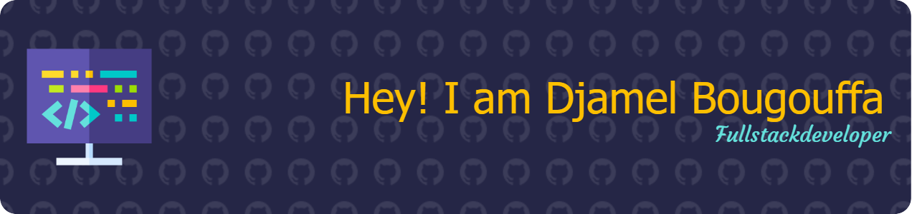

### 
I'm Djamel, Full-Stack Software Engineer 👨‍💻 passionate about modern web technologies 🚀

## 👨‍💻 About Me

- 🔭 I'm currently open to new opportunities!
- 💼 Over 5 years of experience in full-stack development
- 🌱 Passionate about:
  - Modern Web Architecture & Microservices
  - DevOps & Cloud Infrastructure (GCP, Docker, K8s)
  - Component-Based Architecture & Atomic Design
  - Test-Driven Development & Clean Code
- 📫 Reach me at: dbougouffa@gmail.com
- 🌐 Portfolio: [djamel-bougouffa.com](https://djamel-bougouffa.com)
- 🗣️ Languages: French (Native), English (Professional)

## 🛠️ Technical Stack

### Languages & Frameworks
- **Frontend**: TypeScript, JavaScript, React.js, Redux, HTML5, CSS3
- **Backend**: Node.js, NestJS, Express.js, PHP
- **Testing**: Jest, Cucumber.js
- **API**: REST, GraphQL, WebSocket, Apollo Server/Client
- **ORM**: TypeORM, Sequelize, Mongoose

### Databases & Infrastructure
- **Databases**: PostgreSQL, MySQL, MariaDB, MongoDB, Redis
- **DevOps**: Docker, Kubernetes, Swarm, Traefik, Jenkins, GitHub Actions
- **Cloud**: Google Cloud Platform (GCP), Portainer

### Methodologies & Patterns
- **Architecture**: Hexagonal Architecture, Microservices, MVC
- **Design**: Atomic Design, Object-Oriented Programming, Design Patterns
- **Process**: Agile, Scrum

## 📊 GitHub Statistics

  
  

  

  
  
  

## 🎯 Featured Projects

### 🎙️ VoiceVista
- Innovative music and podcast streaming application
- Technologies: React Native, TypeScript, Node.js, PostgreSQL
- Key Features:
  - Modern and intuitive user interface
  - High-quality audio streaming
  - Playlist and favorites management
  - Personalized recommendation system
- [GitHub](https://github.com/strawbang/VoiceVista)

### 💼 Consultant Tracking
- Microservices-based web application for consultant time tracking and management
- Technologies: 
  - Frontend: Angular 14, TypeScript, SCSS, NgRx
  - Backend: Spring Boot 3, Java 17, Hibernate
  - Database: MariaDB
  - Infrastructure: Docker, Docker Swarm, Traefik
  - CI/CD: GitHub Actions
- Key Features:
  - Time tracking with activity logs
  - Project and task organization
  - Client management interface
  - Automated reporting system
  - Microservices architecture
  - Containerized deployment with Docker Swarm
  - Load balancing with Traefik
  - Secure authentication system
- [GitHub](https://github.com/strawbang/consultant-tracking)

 

## 💼 Professional Experience

### Full-Stack Software Engineer | Wemanity Group (METRO FRANCE)
#### Paris, France | March 2022 - March 2024
- 🏗️ Led development of warehouse operations and employee management systems
- 🚀 Implemented advanced kiosk features and order tracking screens
- 📊 Developed innovative employee bonus management system for 93 warehouses
- 🔧 Tech Stack: TypeScript, GCP, Kubernetes, Scrum

### Full-Stack Software Engineer | MaFormation Médicale
#### Paris, France | October 2020 - December 2021
- 🔄 Led transition from PHP to JavaScript stack
- 🎨 Designed and implemented NodeJS/React application
- 🏛️ Established component-based architecture for better scalability

### Full-Stack Software Engineer | Fokal Studio
#### Ferrières-en-Brie, France | June 2018 - May 2020
- 💻 Led development of custom client websites
- 🔧 Specialized in WordPress customization and digital solutions
- 🚀 Drove digital transformation initiatives

## 🎓 Education

- **Master of Engineering, Computer Science** - Expert Architect Web
  *Institut F2I, Paris | 2021*
  
- **Bachelor's Degree in Computer Engineering** - Digital Project Manager
  *Institut F2I, Paris | 2020*
  
- **Diploma of Advanced Technician** - Solutions and Business Applications
  *IRIS, Paris | 2018*

## Connect with me

  

## 🏆 Key Achievements

- 🌟 Successfully led development of warehouse management system impacting 93 METRO France locations
- 🚀 Drove successful transition from PHP to modern JavaScript stack at MaFormation Médicale
- 📈 Implemented component-based architecture improving development efficiency and scalability
- 🔧 Established standardized technologies and processes across multiple projects
- 👥 Actively contributed to knowledge sharing and team collaboration

## 📝 Latest Blog Posts

<!-- BLOG-POST-LIST:START -->
- [10 Key Trends Shaping the Future of Software Development by 2025](https://medium.com/@strawbang/10-key-trends-shaping-the-future-of-software-development-by-2025-b0c666b9a6fe?source=rss-d674a1d03194------2)
- [Mastering a New Language: Cloning a Feature-Rich App to Achieve Excellence](https://medium.com/@strawbang/mastering-a-new-language-cloning-a-feature-rich-app-to-achieve-excellence-e5bff554c571?source=rss-d674a1d03194------2)
- [Building a Blazing-Fast Portfolio with Astro and Deploying with Netlify](https://medium.com/@strawbang/building-a-blazing-fast-portfolio-with-astro-and-deploying-with-netlify-28c6022de1ef?source=rss-d674a1d03194------2)
- [Full-Remote Bliss: Fullstack Dev’s Jet Lag Advantage](https://medium.com/@strawbang/full-remote-bliss-fullstack-devs-jet-lag-advantage-f90cb2df34b1?source=rss-d674a1d03194------2)
<!-- BLOG-POST-LIST:END -->
