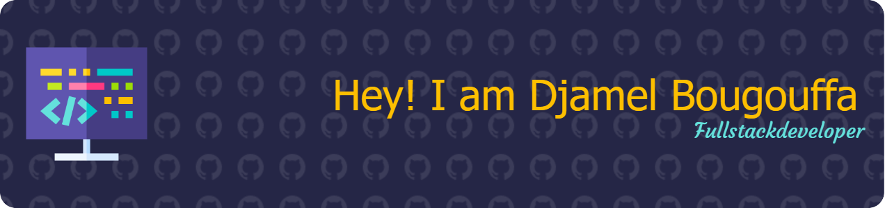

### I'm Djamel, Full-Stack Software Engineer 👨‍💻 passionate about modern web technologies & AI 🚀

� **Currently:** Ippon Technologies AI Lab — building AI-driven legacy modernization tools in Rust
🎯 **Mission:** SUEZ IWS — Liferay → Angular micro-frontends, CI/CD, security hardening
🌐 **Portfolio:** [djamel-bougouffa.com](https://djamel-bougouffa.com) · 📫 djamel.bougouffa@gmail.com

---

## 🛠️ Tech Stack

**Languages**

**Frontend**

**Backend**

**AI & Tooling**

**DevOps & Cloud**

**Databases**

## 🏆 Trophies

  

## 📊 GitHub Statistics

  
  

  

  
  
  

## 🎯 Featured Projects

### 🦀 MCP CLI — Model Context Protocol in Rust
- CLI tool and MCP server exposing terminal commands as AI-callable tools
- Powers agentic workflows in Claude Code, Cursor, and Windsurf
- Technologies: Rust, MCP, TypeScript
- [Read the article](https://djamel-bougouffa.com/blog/model-context-protocol-mcp-cli-rust-ide/)

### 💼 Consultant Tracking
- Full-stack web app for consultant time tracking with hexagonal architecture
- Technologies: Angular 14, Spring Boot 3, Java 17, Docker Swarm, Traefik, GitHub Actions
- Architecture: Hexagonal (Ports & Adapters) backend + NgRx frontend
- [GitHub](https://github.com/strawbang/consultant-tracking)

 

## 🤝 Open Source Contributions

- **[DefinitelyTyped/DefinitelyTyped](https://github.com/DefinitelyTyped/DefinitelyTyped)** — Added French documentation ([#66193](https://github.com/DefinitelyTyped/DefinitelyTyped/pull/66193))
- **[tree-sitter/tree-sitter-rust](https://github.com/tree-sitter/tree-sitter-rust)** — Fix incorrect parsing of unary operators after the `..` range operator (e.g. `..*a` was parsed as a binary expression instead of a prefix range)

## 💼 Experience & Education

Full details on my [portfolio](https://djamel-bougouffa.com/about/) — highlights:

| Period | Role | Company |
|--------|------|---------|
| Mar 2026 – Present | Full-Stack Developer | SUEZ IWS (via Ippon) |
| Feb 2026 – Present | Software Engineer — AI Lab | Ippon Technologies |
| Nov 2025 – Feb 2026 | Software Engineer — R&D | Ippon Technologies |
| Jan 2025 – Apr 2025 | Software Engineer | SYSTRAN by ChapsVision |
| Mar 2022 – Mar 2024 | Fullstack Developer | Wemanity Group (METRO France) |
| Sep 2020 – Feb 2022 | Fullstack Developer | Ma Formation Médicale |

🎓 Master's in Computer Engineering — Institut F2I, Paris (2021)

## Connect with me

## 🏆 Key Achievements

- 🦀 Built a production Rust AI tool (RAG + MCP + Tree-sitter) deployed on AWS with Terraform and GitLab OIDC CI/CD
- 🔄 Migrating a legacy Liferay B2B extranet to Angular micro-frontends for SUEZ IWS industrial platform
- 🌟 Led development of warehouse management system impacting 93 METRO France locations
- 🚀 Led PHP → JavaScript stack transition at MaFormation Médicale (+40% performance)
- 📝 Technical writer: articles on Claude Code + MCP, RAG on AWS, software craftsmanship at [djamel-bougouffa.com](https://djamel-bougouffa.com/blog/)

## 📝 Latest Blog Posts

### Personal Blog
<!-- PERSONAL-BLOG-LIST:START -->
- [How Standardizing a Tech Stack Cut Product Creation Time by 80%](https://djamel-bougouffa.com/blog/stack-standardization-80-percent-faster/)
- [AI Broke Our Production Code. Here&#39;s the Craftsmanship Rule That Would Have Prevented It](https://djamel-bougouffa.com/blog/software-craftsmanship-ai-era/)
- [How I Use Claude Code and Jira MCP to Modernize Legacy Codebases](https://djamel-bougouffa.com/blog/claude-code-jira-mcp-legacy-codebase/)
- [Model Context Protocol &lpar;MCP&rpar;: Exposing a Rust CLI to Your IDE](https://djamel-bougouffa.com/blog/model-context-protocol-mcp-cli-rust-ide/)
- [Spec-Driven Development: From Specification to Code with AI](https://djamel-bougouffa.com/blog/spec-driven-development/)
<!-- PERSONAL-BLOG-LIST:END -->
